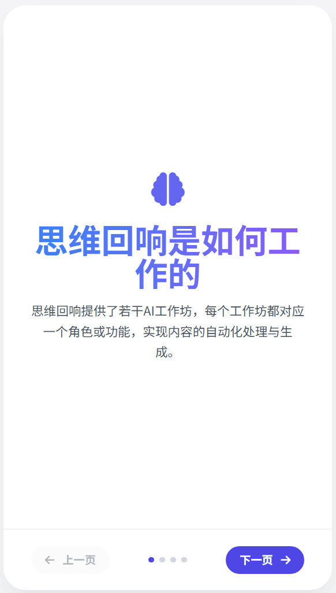
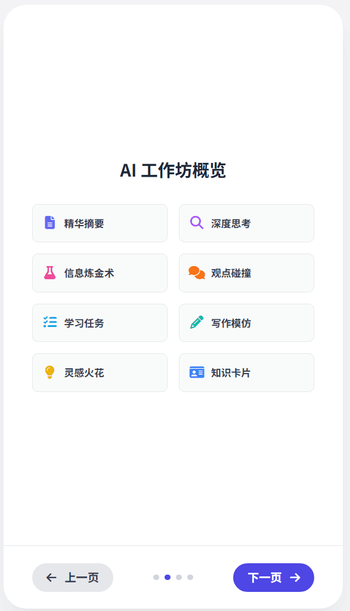
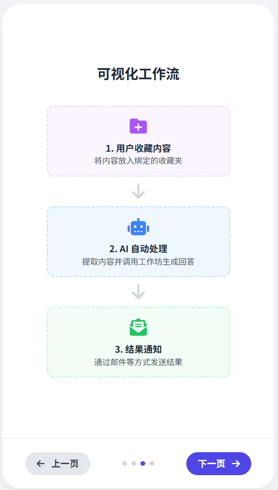
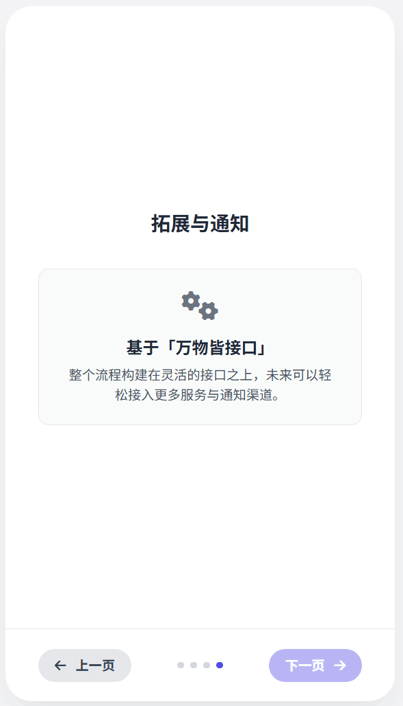

# MindEcho（思维回响）

<div align="center">

**让收藏不再沉默，让知识产生回响**

*你的私人认知伙伴，将被动的信息囤积转化为主动的知识综合*

[](https://www.python.org/downloads/)
[](https://nuxt.com/)
[](LICENSE)

[English](./README_EN.md) | 简体中文

[功能特性](#功能特性) • [快速开始](#快速开始) • [架构设计](#架构设计) • [文档](#文档)

</div>

---

## 💡 我们面临的问题

我们生活在一个悖论之中：**我们收集信息的速度前所未有，却以同样的效率将其遗忘**。

- 📱 你的B站收藏夹？**8000+视频，再也没看过**
- 📕 你的小红书收藏？**信息墓地，而非灵感金矿**
- 📚 你的笔记应用？**孤立的碎片，断裂的洞察**
- 🤖 你的AI工具？**需要手动输入，复制粘贴的摩擦**

**真正的瓶颈不是存储——而是转化。**

---

## ✨ MindEcho 解决方案

MindEcho 不仅仅是另一个信息管理工具。它是一个**私人认知伙伴**，自动将你分散的数字收藏转化为**互联的知识网络**。

### 它是如何工作的





### 四大战略支柱

#### 🔒 **1. 绝对隐私与数据主权**
> *"你的思想只属于你自己。"*

- ✅ **100% 本地执行** — 无云处理，无数据收集
- ✅ **你的数据，你的规则** — 完全控制你的信息
- ✅ **离线可用** — 设置完成后无需联网

#### 🤖 **2. 深度自动化与主动智能**
> *"在你忘记之前，MindEcho 已经为你思考过了。"*

- ✅ **零干预自动化** — 在后台静默工作
- ✅ **智能监控** — 24/7 监控你喜欢的平台
- ✅ **自动触发处理** — 点击"收藏"的瞬间，AI分析就已启动

#### 🕸️ **3. 互联知识网络** *(即将推出)*
> *"激活你的整个知识库——让每一次收藏在你的思维中回响。"*

- 🔜 **语义链接** — 自动连接新内容与你的知识历史
- 🔜 **知识图谱** — 可视化想法之间的关系
- 🔜 **智能推荐** — 在相关时刻唤醒被遗忘的洞察

#### ⚡ **4. 一体化工作流**
> *"从信息噪音到最终产物，一步到位。"*

- ✅ **多模态输入** — 视频、图片、文本（支持B站、小红书）
- ✅ **AI处理** — 摘要、深度分析、观点对撞
- ✅ **结构化输出** — 报告、洞察、行动项
- ✅ **替代5-6个工具** — 统一体验

---

## 🎯 功能特性

### 对于内容消费者

| 功能 | 描述 | 状态 |
|------|------|------|
| 🎬 **自动同步收藏** | 自动同步你的B站/小红书收藏 | ✅ 已完成 |
| 📊 **智能仪表盘** | 所有知识活动的可视化概览 | ✅ 已完成 |
| 🔍 **全局搜索** | 搜索标题、描述和AI洞察 | ✅ 已完成 |
| 📥 **收件箱分类** | 一键处理待处理项目 | ✅ 已完成 |
| 🏷️ **智能标签** | 用标签组织，按平台/作者筛选 | ✅ 已完成 |

### 对于知识工作者

| 功能 | 描述 | 状态 |
|------|------|------|
| 🧠 **AI工作坊** | 多种分析模式（摘要、深度洞察、辩论） | ✅ 已完成 |
| ⚙️ **自定义工作流** | 创建你自己的分析管道 | ✅ 已完成 |
| 🔄 **自动触发** | 将工作坊绑定到收藏夹以自动处理 | ✅ 已完成 |
| 📝 **结果管理** | 编辑、重新生成或删除AI输出 | ✅ 已完成 |
| 🎨 **多平台** | 所有来源的统一界面 | ✅ 已完成 |

### 内置AI工作坊

| 工作坊 | 用途 | 输出示例 |
|--------|------|----------|
| 📖 **精准摘要** | 提取核心思想 | "100字内的3个关键点" |
| 💎 **快照洞察** | 深度分析 | "隐藏的模式与含义" |
| ⚗️ **信息炼金术** | 交叉引用综合 | "连接5个来源的想法" |
| ⚔️ **观点对撞** | 魔鬼代言人 | "对此主张的3个反驳论点" |

---

## 🚀 快速开始

### 前置要求

- **Python 3.12+**（用于后端）
- **Node.js 18+**（用于前端）
- **Git**（用于克隆）

### 安装

#### 0. 配置万物皆接口应用(https://github.com/hc-tec/everything-as-an-interface)

#### 1. 克隆仓库

```bash
git clone https://github.com/hc-tec/mindecho.git
cd mindecho
```

#### 2. 设置后端

```bash
# 进入后端目录
cd backend

# 创建虚拟环境（推荐）
python -m venv venv
source venv/bin/activate  # Windows: venv\Scripts\activate

# 安装依赖
pip install -r requirements.txt

# 启动后端服务器
python run_server.py
```

后端API将在 `http://localhost:8001` 上可用

#### 3. 设置前端

```bash
# 进入前端目录（在新终端中）
cd frontend

# 安装依赖
npm install

# 启动开发服务器
npm run dev
```

前端将在 `http://localhost:3001` 上可用

#### 4. 初始配置

1. **打开浏览器** → `http://localhost:3001`
2. **进入设置** → 配置你的AI模型和偏好
3. **同步收藏** → 设置 → 监听管理 → 启用工作坊
4. **绑定收藏夹** → 将你的收藏夹链接到特定工作坊
5. **开始收藏** → 在B站/小红书上收藏内容，看MindEcho工作！

---

## 📚 工作原理

### 自动处理流程

```
┌─────────────────────────────────────────────────────────────┐
│ 1. 你在B站/小红书上收藏内容                                │
└─────────────┬───────────────────────────────────────────────┘
              │
              ▼
┌─────────────────────────────────────────────────────────────┐
│ 2. MindEcho通过连续流监控                                   │
│    • 实时检测新收藏                                         │
│    • 无需手动同步                                           │
└─────────────┬───────────────────────────────────────────────┘
              │
              ▼
┌─────────────────────────────────────────────────────────────┐
│ 3. 自动获取完整详情                                         │
│    • 视频元数据、统计数据                                   │
│    • 字幕（前100行）                                        │
│    • 作者信息、标签                                         │
└─────────────┬───────────────────────────────────────────────┘
              │
              ▼
┌─────────────────────────────────────────────────────────────┐
│ 4. 触发绑定的工作坊                                         │
│    • 收藏夹"深度思考" → 工作坊"快照洞察"                   │
│    • 收藏夹"学习资料" → 工作坊"精准摘要"                   │
└─────────────┬───────────────────────────────────────────────┘
              │
              ▼
┌─────────────────────────────────────────────────────────────┐
│ 5. AI在后台分析内容                                         │
│    • 处理丰富的上下文（标题、简介、字幕）                   │
│    • 生成结构化洞察                                         │
│    • 保存到本地数据库                                       │
└─────────────┬───────────────────────────────────────────────┘
              │
              ▼
┌─────────────────────────────────────────────────────────────┐
│ 6. 结果立即可用                                             │
│    • 在仪表盘中查看                                         │
│    • 搜索、编辑、重新生成                                   │
│    • 所有数据保持本地                                       │
└─────────────────────────────────────────────────────────────┘
```

### 智能路由

MindEcho智能地将内容路由到正确的工作坊：

```python
# 示例：收藏夹 → 工作坊绑定
{
  "快照洞察": {
    "bilibili": ["深度思考", "哲学思辨"],
    "xiaohongshu": ["读书笔记"]
  },
  "精准摘要": {
    "bilibili": ["技术教程", "学习资料"]
  }
}
```

**结果：**在"深度思考"中收藏的视频自动获得深度分析，而"技术教程"视频获得简洁摘要。

---

## 🏗️ 架构设计

### 技术栈

| 层级 | 技术 | 用途 |
|------|------|------|
| **前端** | Nuxt 3 + Vue 3 + TypeScript | 响应式UI，基于文件的路由 |
| **状态** | Pinia | 集中式状态管理 |
| **UI** | shadcn-vue + TailwindCSS | 可访问组件，现代设计 |
| **后端** | FastAPI + Python 3.12+ | 异步API，类型安全 |
| **数据库** | SQLite + SQLAlchemy（异步） | 本地存储，零配置 |
| **任务队列** | Huey | 后台作业处理 |
| **AI** | 外部RPC服务 | LLM调用，网页抓取 |

### 系统架构

```
┌─────────────────────────────────────────────────────────────┐
│                         前端                                 │
│  ┌─────────┐  ┌──────────┐  ┌─────────┐  ┌──────────┐    │
│  │仪表盘   │  │收藏管理  │  │工作坊   │  │ 设置     │    │
│  └────┬────┘  └────┬─────┘  └────┬────┘  └────┬─────┘    │
│       │            │             │            │            │
│       └────────────┴─────────────┴────────────┘            │
│                         │                                   │
│                    API客户端                                │
└─────────────────────────┼───────────────────────────────────┘
                          │ HTTP/WebSocket
┌─────────────────────────┼───────────────────────────────────┐
│                    FastAPI后端                               │
│  ┌──────────────────────┴────────────────────────────────┐ │
│  │                 API端点                                │ │
│  └──────┬───────────────────────────────────────┬────────┘ │
│         │                                        │          │
│  ┌──────▼────────┐                       ┌──────▼────────┐ │
│  │   服务层      │                       │ 流管理器      │ │
│  │  - 工作坊     │◄──────────────────────│ - 监控        │ │
│  │  - 收藏       │                       │ - 自动触发    │ │
│  │  - 仪表盘     │                       └───────────────┘ │
│  └──────┬────────┘                                         │
│         │                                                   │
│  ┌──────▼────────┐          ┌────────────────┐           │
│  │     CRUD      │◄─────────│  任务队列      │           │
│  │  数据访问层   │          │    (Huey)      │           │
│  └──────┬────────┘          └────────────────┘           │
│         │                                                   │
│  ┌──────▼──────────────────────────────────────────────┐  │
│  │              SQLite数据库（本地）                    │  │
│  │  - favorites - workshops - tasks - results - tags   │  │
│  └────────────────────────────────────────────────────────┘  │
└─────────────────────────────────────────────────────────────┘
                          │
                    RPC客户端
                          │
┌─────────────────────────▼───────────────────────────────────┐
│                  外部RPC服务                                 │
│  ┌──────────────┐  ┌──────────────┐  ┌─────────────────┐  │
│  │ LLM API      │  │ 网页抓取     │  │ 平台认证        │  │
│  │ (豆包)       │  │ (B站/小红书) │  │ (Cookie管理)    │  │
│  └──────────────┘  └──────────────┘  └─────────────────┘  │
└─────────────────────────────────────────────────────────────┘
```

### 核心设计模式

#### 1. 流驱动自动化

```python
# 外部平台的连续监控
流管理器
  ├─ B站流（监控收藏夹）
  ├─ 小红书流（监控收藏）
  └─ 事件编排器
      ├─ 解析事件
      ├─ 持久化简要项
      ├─ 同步详情
      └─ 创建工作坊任务（自动）
```

#### 2. 工作坊系统

```python
# 可插拔的AI处理管道
工作坊（模板）
  ├─ workshop_id: "snapshot-insight"
  ├─ executor_type: "llm_chat"
  ├─ default_prompt: "深度分析..."
  └─ platform_bindings: [
      {"platform": "bilibili", "collection_ids": [1, 2, 3]}
  ]

任务（执行实例）
  ├─ status: pending → in_progress → success/failure
  ├─ favorite_item_id: 123
  └─ workshop_id: "snapshot-insight"

结果（输出）
  ├─ content: "# 深度分析\n..."
  ├─ task_id: 456
  └─ favorite_item_id: 123
```

#### 3. 智能路由

```python
# 收藏夹 → 工作坊映射
if item.collection_id in workshop.platform_bindings:
    create_task(workshop_id, item_id)
else:
    fallback_to_default_workshop()
```

---

## 📖 文档

### API文档

后端运行后，访问：
- **Swagger UI**：`http://localhost:8001/docs`
- **ReDoc**：`http://localhost:8001/redoc`

### 核心端点

| 端点 | 方法 | 描述 |
|------|------|------|
| `/api/v1/dashboard` | GET | 仪表盘概览数据 |
| `/api/v1/collections` | GET | 列出收藏项（分页） |
| `/api/v1/workshops` | GET | 列出可用工作坊 |
| `/api/v1/workshops/{id}/execute` | POST | 在项目上触发工作坊 |
| `/api/v1/tasks/{id}` | GET | 获取任务状态 |
| `/api/v1/sync/bilibili/collections` | POST | 同步B站收藏夹 |
| `/api/v1/streams` | GET | 列出活动监控流 |
| `/api/v1/settings` | GET/PUT | 管理应用设置 |

### 环境变量配置

MindEcho 支持通过 `.env` 文件配置所有环境变量，避免在代码中硬编码敏感信息。

#### 配置步骤

1. **创建 .env 文件**

```bash
cd backend
cp .env.example .env
```

2. **编辑 .env 文件**

```bash
# 使用你喜欢的编辑器打开 .env
vim .env  # 或 nano .env、code .env
```

#### 配置项说明

##### 数据库配置
```bash
DATABASE_URL=sqlite+aiosqlite:///./mindecho.db
```

##### EAI RPC 服务配置
用于 LLM 调用和网页抓取（需要先配置 [everything-as-an-interface](https://github.com/hc-tec/everything-as-an-interface)）
```bash
EAI_BASE_URL=http://127.0.0.1:8008
EAI_API_KEY=your_api_key_here
```

##### Bilibili 配置
```bash
# Cookie ID（从浏览器中获取）
BILIBILI_COOKIE_IDS=["your-cookie-id-1", "your-cookie-id-2"]

# 插件和流配置
BILIBILI_FAVORITES_PLUGIN_ID=bilibili_collection_videos
BILIBILI_FAVORITES_STREAM_GROUP=bilibili_collection_videos-updates
BILIBILI_STREAM_INTERVAL=120

# 指纹字段（用于去重）
BILIBILI_FINGERPRINT_FIELDS=["id", "bvid"]

# 任务完成后关闭页面
BILIBILI_CLOSE_PAGE_WHEN_TASK_FINISHED=true

# 详情获取重试次数
BILIBILI_DETAILS_MAX_RETRY_ATTEMPTS=5
```

##### 小红书配置
```bash
# Cookie ID（从浏览器中获取）
XIAOHONGSHU_COOKIE_IDS=["your-xiaohongshu-cookie-id"]

# 插件和流配置
XIAOHONGSHU_FAVORITES_PLUGIN_ID=xiaohongshu_favorites_brief
XIAOHONGSHU_STREAM_INTERVAL=120
XIAOHONGSHU_FINGERPRINT_FIELDS=["id"]
```

##### 流处理配置
```bash
# 首次同步阈值（超过此数量视为首次同步）
FIRST_SYNC_THRESHOLD=50

# 详情获取重试配置
XIAOHONGSHU_DETAILS_RETRY_DELAY_MINUTES=5
XIAOHONGSHU_DETAILS_MAX_RETRY_ATTEMPTS=5
```

##### SMTP 邮件通知配置（可选）
如果需要邮件通知功能，配置以下选项：

**Gmail 示例：**
```bash
SMTP_HOST=smtp.gmail.com
SMTP_PORT=587
SMTP_USER=your_email@gmail.com
SMTP_PASSWORD=your_app_specific_password
EMAIL_FROM=your_email@gmail.com
EMAIL_TO=recipient@example.com
```

**QQ 邮箱示例：**
```bash
SMTP_HOST=smtp.qq.com
SMTP_PORT=587
SMTP_USER=your_qq_number@qq.com
SMTP_PASSWORD=your_authorization_code
EMAIL_FROM=your_qq_number@qq.com
EMAIL_TO=recipient@example.com
```

**163 邮箱示例：**
```bash
SMTP_HOST=smtp.163.com
SMTP_PORT=465
SMTP_USER=your_email@163.com
SMTP_PASSWORD=your_authorization_code
EMAIL_FROM=your_email@163.com
EMAIL_TO=recipient@example.com
```

##### 元宝 AI 配置
```bash
YUANBAO_COOKIE_IDS=["your-yuanbao-cookie-id"]
YUANBAO_CONVERSATION_ID=your-conversation-id
```

#### 重要提示

⚠️ **安全注意事项：**
- `.env` 文件包含敏感信息，**永远不要提交到 Git**
- `.gitignore` 已配置忽略 `.env` 文件
- 只提交 `.env.example` 作为模板

⚠️ **Cookie 获取方法：**
1. 打开浏览器开发者工具（F12）
2. ���录目标平台（Bilibili/小红书等）
3. 在 Application/存储 → Cookies 中查找相关 Cookie
4. 复制 Cookie 值到配置文件

详细配置指南请参考：
- `backend/.env.example` - 完整配置模板
- `backend/SMTP_CONFIG_GUIDE.md` - SMTP 邮件配置详细指南

---

## 🧪 开发

### 运行测试

```bash
# 后端测试
cd backend
pytest                              # 运行所有测试
pytest -v                           # 详细输出
pytest --cov=app --cov-report=html  # 带覆盖率报告
pytest tests/api/endpoints/         # 特定目录

# 前端测试（如果可用）
cd frontend
npm run test
```

### 代码质量

```bash
# 后端代码检查
cd backend
ruff check .                        # 检查问题
ruff check . --fix                  # 自动修复问题

# 类型检查
mypy app/
```

### 数据库管理

```bash
# 查看数据库
cd backend
sqlite3 mindecho.db
.tables                             # 列出表
.schema favorite_items              # 查看模式
SELECT * FROM tasks LIMIT 10;       # 查询数据
```

---

## 🛠️ 故障排除

### 常见问题

**问：后端无法启动**
- 检查Python版本：`python --version`（必须是3.12+）
- 验证依赖：`pip install -r requirements.txt`
- 检查 `.env` 文件是否存在并配置有效

**问：前端无法连接到后端**
- 确保后端在8001端口运行
- 检查 `backend/app/main.py` 中的CORS设置
- 验证 `frontend/app/lib/api.ts` 中的API URL

**问：工作坊不自动触发**
- 验证流正在运行：`GET /api/v1/streams`
- 检查设置 → 监听管理中的平台绑定
- 启用工作坊的监听开关
- 查看后端日志中的错误

**问：没有生成AI结果**
- 验证 EAI_BASE_URL 和 EAI_API_KEY 已设置
- 检查外部RPC服务是否运行
- 查看任务状态：`GET /api/v1/tasks/{id}`
- 检查后端日志中的LLM错误

---

## 🗺️ 路线图

### ✅ 第一阶段：基础（已完成）
- [x] 基本收藏同步
- [x] 工作坊系统
- [x] 自动触发
- [x] 多平台支持（B站、小红书）
- [x] 智能路由

### 🚧 第二阶段：智能化（进行中）
- [ ] 语义链接引擎
- [ ] 知识图谱可视化
- [ ] 智能推荐
- [ ] 跨平台综合

### 📋 第三阶段：扩展（计划中）
- [ ] 更多平台集成（YouTube、Twitter、播客）
- [ ] 导出格式（Markdown、Anki、Notion）
- [ ] 工作坊链接（多步骤管道）
- [ ] 移动应用

### 🔮 第四阶段：高级（未来）
- [ ] 本地LLM支持（无需外部RPC）
- [ ] 知识差距检测
- [ ] 间隔重复系统
- [ ] 协作知识共享

---

## 🤝 贡献

MindEcho目前正在积极开发中。欢迎贡献！

### 开发原则

1. **隐私优先**：绝不将用户数据发送到外部服务
2. **自动化优先**：尽可能减少手动工作
3. **质量优先**：没有"足够好"——每个细节都很重要
4. **测试优先**：所有新功能必须有测试

### 如何贡献

1. Fork仓库
2. 创建功能分支：`git checkout -b feature/amazing-feature`
3. 进行更改并添加测试
4. 运行测试和代码检查
5. 提交并附上清晰的消息：`git commit -m 'feat: add amazing feature'`
6. 推送到你的分支：`git push origin feature/amazing-feature`
7. 打开Pull Request

---

## 📄 许可证

本项目目前为**私有**，供个人/内部使用。如需许可咨询，请联系作者。

---

## 🙏 致谢

- **FastAPI** - 现代Python Web框架
- **Nuxt** - 直观的Vue框架
- **shadcn-vue** - 美观的可访问组件
- **SQLAlchemy** - 强大的ORM
- 所有开源贡献者

---

## 💬 支持

- **问题反馈**：[GitHub Issues](https://github.com/hc-tec/mindecho/issues)
- **讨论**：[GitHub Discussions](https://github.com/hc-tec/mindecho/discussions)
- **QQ群(1060464232)**：点击链接加入群聊【思维回响 | 技术交流】：http://qm.qq.com/cgi-bin/qm/qr?_wv=1027&k=jJJq2p7q_TG4DAqAs_MLvR2SoXJnhGAc&authKey=Ed%2FqyO1tSR4bJp1WYYIwkTy8e7vfCdOybGkBejjHPcS2Q8OOH7oLg0EcaJAfIvHL&noverify=0&group_code=1060464232

---

<div align="center">

**用 ❤️ 为拒绝遗忘的知识工作者打造**

*"在你忘记之前，MindEcho已经为你思考过了。"*

[⬆ 返回顶部](#mindecho思维回响)

</div>
